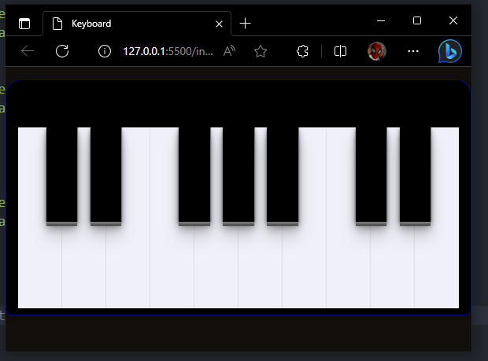
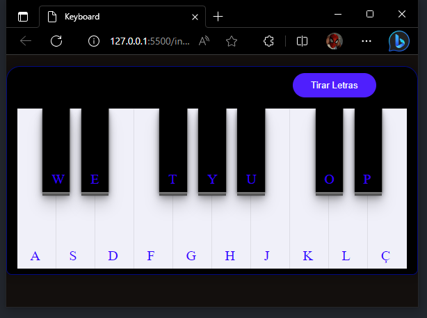

# SIMULADOR DE TECLADO
---
> __Tecnologias__
> - JavaScript
> - HTML
> - CSS

---
<h1 align="center">Versões:</h1>

### v1.0
Versão inicial, adição de sons e teclas 

### v1.1
Adição da opção para mostrar as referentes letras no teclado 

